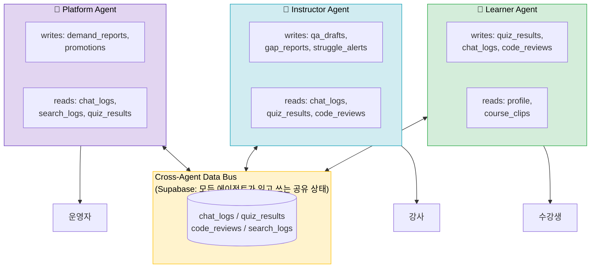
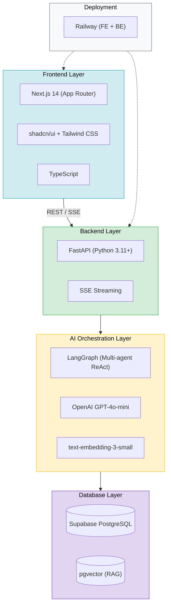
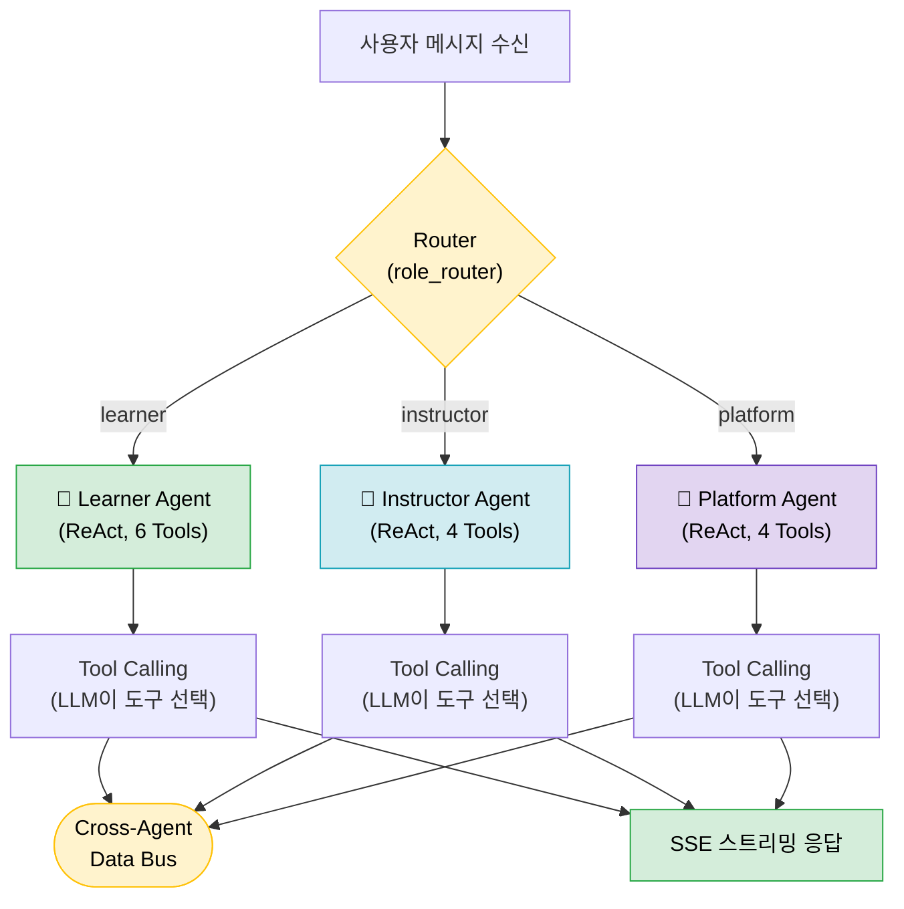
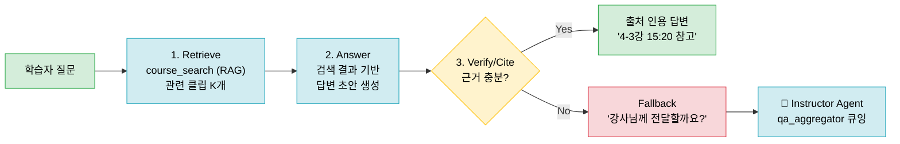
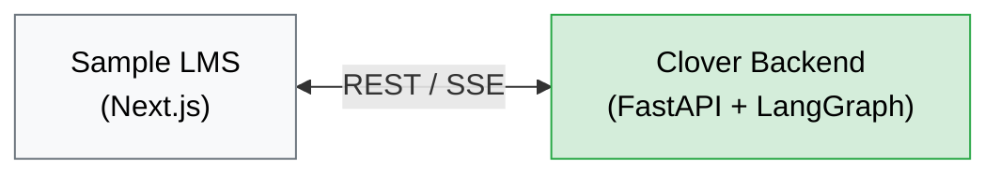
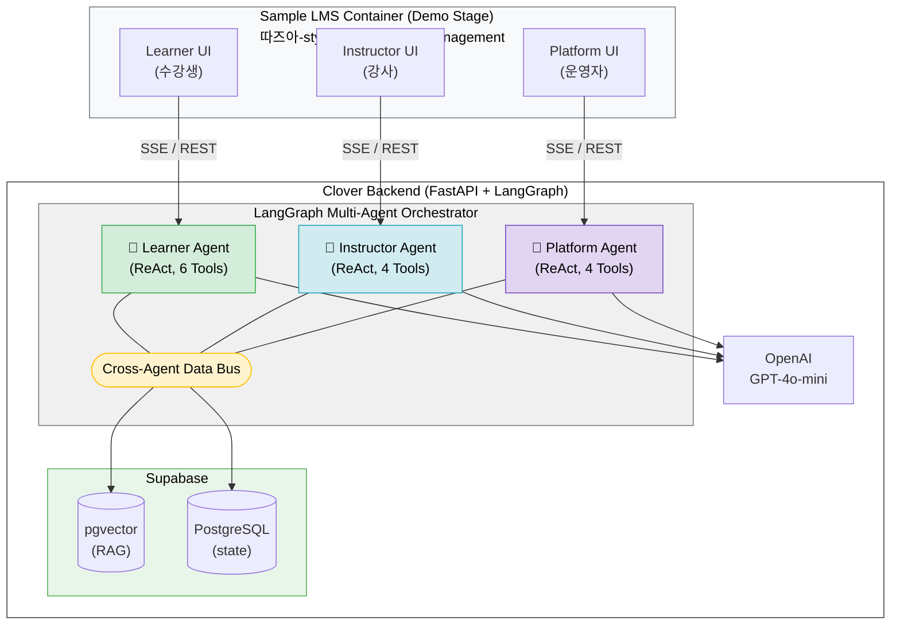
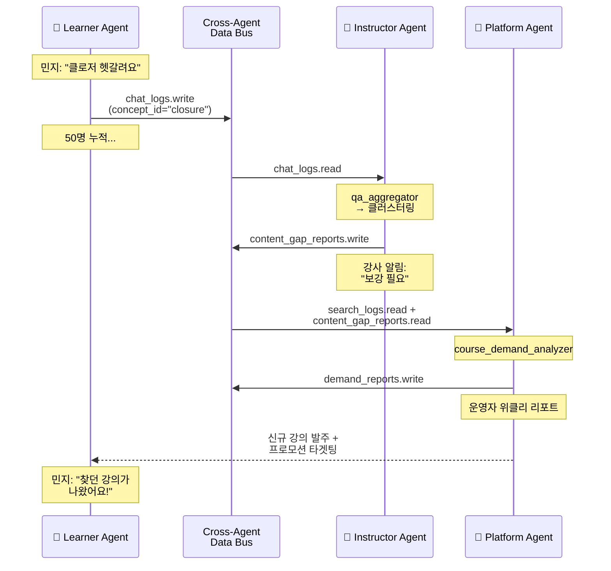
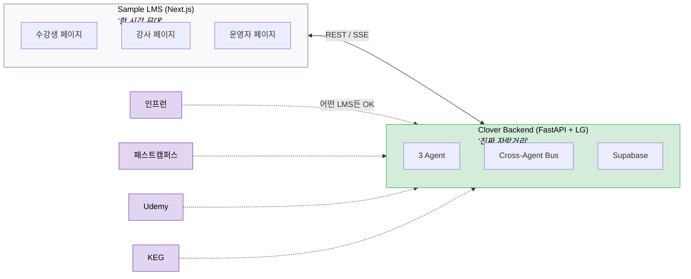

> **[안내] 이 문서는 AI 리포트 양식 초안입니다. 최종 제출 시 공식 docx 양식(`③ 2026 KIT 바이브코딩 공모전_팀명(개인은 이름)_AI리포트.docx`)에 옮겨 넣어야 합니다.**

---

# AI 리포트 — 작성 초안

## 기본 정보

| 항목 | 내용 |
|------|------|
| **팀명** | clover |
| **휴대폰번호 (대표자)** | (추후 기입) |
| **프로젝트명** | **Clover 🍀** — 3-Agent Education Orchestrator |
| **슬로건** | 교육에 행운을, 모두에게 — *Luck for Learning, for Everyone* |
| **GitHub** | https://github.com/Kimyb8870/kit-hackathon |
| **라이브 URL** | https://clover-frontend-production.up.railway.app |

---

## 1. 기획

### ■ 설정한 사용자는 누구이며, 해결하려는 구체적인 문제점/불편함은 무엇인가요?

#### 단일 사용자가 아닌 "3 주체"가 함께 사는 생태계

기존 AI 교육 솔루션들은 모두 **수강생만** 본다. 그러나 교육 플랫폼은 본질적으로 **수강생·강사·운영자** 세 주체가 동시에 존재하는 시스템이다. Clover는 단일 사용자를 위한 도구가 아닌, **세 주체의 페인포인트를 동시에 해결하는 교육 생태계 OS**를 지향한다.

| 주체 | 페르소나 | 핵심 질문 | 해결되지 않은 페인포인트 |
|------|---------|---------|-----------------------|
| **🌱 수강생 (Learner)** | "코딩을 배우려는 직장인 민지" | "내가 잘 하고 있나?" | 강사 답변 수 주 지연, 자신감 부재(개발자 임포스터 58%), 코드 리뷰 전무, 수료증 채용시장 무가치 |
| **🍃 강사 (Instructor)** | "퇴근 후 강의를 만드는 수민쌤" | "학생들이 어디서 막혀?" | 같은 질문 100명에게 반복 응답, 학생 막힘 지점 데이터 없음, 신규 콘텐츠 기획 시 학습자 needs 부재 |
| **🌿 운영자 (Platform)** | "콘텐츠 PD 김 매니저" | "어떤 강의를 만들까?" | 신규 강의 수요 데이터 부재, 분기 단위 의사결정 vs 6개월 트렌드 사이클, 일괄 프로모션 → 피로도 |

#### 시장 데이터로 검증된 4-플랫폼 공통 페인포인트

인프런 / 패스트캠퍼스 / Udemy / KEG·따즈아의 공개 리뷰·잡플래닛·Trustpilot·언론 보도를 체계 분석한 결과:

| # | 페인포인트 | 4 플랫폼 공통 | 영향 주체 |
|---|-----------|:------------:|:--------:|
| 1 | 콘텐츠 품질 편차 — 구매 전 예측 불가 | ✅ | 학습자·운영자 |
| 2 | 강사 응답 지연 / 무응답 (수 주 방치) | ✅ | 학습자·강사 |
| 3 | 개인화 학습 경로 부재 (단방향 방송형) | ✅ | 학습자 |
| 4 | 멘토링 / 코드리뷰 전무 | ✅ | 학습자·강사 |
| 5 | 수료증 실질 가치 없음 (포트폴리오 연계 X) | ✅ | 학습자 |
| 6 | 학습 참여도 유지 어려움 (완강률 3~15%) | ✅ | 학습자·운영자 |

**핵심 데이터:**
- MOOC 평균 완강률: **3~15%** (MIT/Harvard 연구), K-MOOC 7~12% (KEDI)
- 즉시 피드백 효과 크기 **d=0.73** (Hattie & Timperley 2007) — 교육 개입 중 상위 10%
- Ebbinghaus 망각 곡선: 학습 1시간 후 56% 망각, 간격 반복으로 기억 유지율 **150~200%** 향상
- 잡플래닛 평점: KEG 2.6/5, SBS아카데미 2.6/5
- Udemy 신뢰도 위기: AI 챗봇 "Alex"만 운영, Trustpilot **1.9/5**, 허위 할인 집단소송 $400만 합의

#### 본질 — 데이터는 있는데 흐르지 않는다

세 주체의 페인포인트는 **모두 같은 데이터에서 나온다.** 학습자의 오답, 학습자의 질문, 학습자의 학습시간. 이 데이터는 LMS 어딘가에 이미 쌓이고 있다. 그러나 그 데이터는 학습자 본인의 대시보드에서 끝난다. 강사에게도, 운영자에게도 흐르지 않는다.

> **Clover의 통찰:** 문제는 데이터 부재가 아니라 **데이터 흐름의 단절**이다. 단일 AI 튜터로는 이 흐름을 만들 수 없다. **각 주체를 위한 전문 에이전트가 같은 데이터 버스 위에서 협업**해야 한다.

---

### ■ 문제를 해결하기 위한 솔루션의 핵심 기능은 무엇인가요?

#### 솔루션 한 줄 정의

> **Clover는 어떤 LMS에든 임베딩 가능한 3-Agent 교육 오케스트레이터다.** 학습자(Learner) · 강사(Instructor) · 운영자(Platform), 세 주체를 위한 전문 AI 에이전트가 같은 데이터 위에서 협업하며 교육 생태계 전체를 최적화한다.

#### 핵심 기능: 3-Agent Orchestration

기능을 "5가지 기능"으로 나열하지 않는다. Clover의 핵심 기능은 단 하나, **세 개의 전문 에이전트가 하나의 데이터 버스 위에서 협업하는 LangGraph multi-agent 시스템**이다.

**🌱 Learner Agent — 학습 성공을 위한 전담 코치 (6 Tools)**

| Tool | 역할 | 핵심 가치 |
|------|------|---------|
| `profile_manager` | 학습자 프로필 CRUD (직무 목표·가용 시간·경험 수준) | 모든 추천의 근거 |
| `course_search` (RAG) | 강의 콘텐츠를 영상 클립 단위로 검색 (timestamp + concept_id) | "4-3강 15:20에서 설명합니다" 정확도 |
| `course_recommender` | 프로필 + 검색 결합 맞춤 학습 경로 추천 | 카테고리/인기순이 아닌 진짜 개인화 |
| `quiz_generator` | 수강 직후 즉석 미니퀴즈 생성 | 능동 학습 (Freeman 2014: 시험 점수 6% 향상) |
| `review_scheduler` | SM-2 기반 적응형 복습 스케줄링 (정답률·응답시간 가중) | Ebbinghaus 망각 극복 |
| `code_reviewer` | 커리큘럼 단계 인식 코드 리뷰 (미학습 개념 가드레일) | 시장에 없는 차별점 |

페르소나: *"옆자리에서 같이 코딩해주는 선배"* — 친근하고 즉시 응답
가드레일: 모든 강의 답변은 `retrieve → answer → verify/cite` 3단계, 반드시 강의 클립 인용

**🍃 Instructor Agent — 강사를 위한 인사이트 어시스턴트 (4 Tools)**

| Tool | 역할 | 입력 데이터 |
|------|------|-----------|
| `qa_aggregator` | 학습자 질문을 의미 단위로 클러스터링 → "상위 10개 질문" | Learner Agent의 chat_logs |
| `content_gap_finder` | 오답률 높은 개념 = 강의에서 충분히 다루지 못한 부분 탐지 | quiz_results, code_reviews |
| `auto_qa_responder` | 강사 검토 대기 중인 Q&A에 AI 초안 작성 → 강사 1-click 승인 | RAG + 강의 메타데이터 |
| `student_struggle_reporter` | 특정 학생이 며칠째 막혀있는지 + 어떤 개념인지 알림 | 학습 시간, 진도, 퀴즈 패턴 |

페르소나: *"교무실에 앉은 조용한 데이터 분석가"* — 묻기 전에 먼저 알려준다
핵심 가치: "강사의 분신"이 아니라 "강사의 의사결정 지원 시스템"

**🌿 Platform Agent — 비즈니스 의사결정을 위한 운영 OS (4 Tools)**

| Tool | 역할 | 비즈니스 임팩트 |
|------|------|----------------|
| `course_demand_analyzer` | "검색은 했지만 결과가 없거나 만족도 낮은 쿼리" 추출 → 신규 강의 후보 | 신규 강의 ROI 예측 |
| `trend_detector` | 검색량 급증 키워드 + 외부 트렌드(GitHub stars 등) 결합 | 콘텐츠 기획 선제 대응 |
| `promotion_recommender` | 학습자 프로필 세그먼트별 맞춤 프로모션 대상 추천 | 일괄 발송 → 정밀 타겟 |
| `revenue_optimizer` | 강의별 완강률 × 만족도 × 매출 매트릭스로 우선순위 | 운영 리소스 배분 |

페르소나: *"조용한 사업기획팀 대리"* — 매주 한 번 기회를 보고한다
핵심 가치: Clover가 단순 학습 도구가 아닌 **수익 최적화 파트너**임을 증명

#### 핵심 차별점: Cross-Agent Data Bus

> **한 에이전트가 만든 데이터가 다른 에이전트의 입력이 된다.**



**한 사이클 예시 (concept_id가 데이터 흐름을 가로지른다):**

1. 수강생 민지가 *"클로저랑 실행 컨텍스트가 헷갈려요"* 질문 → **Learner Agent**가 답변, `chat_log`에 기록
2. 수강생 B, C, D... 50명이 같은 종류 질문 → **Instructor Agent**가 클러스터링 감지 → 강사에게 *"이 개념 보강 필요"* 알림 + 보강 답변 초안
3. **Platform Agent**가 *"클로저 보강 콘텐츠 검색은 많은데 매칭 강의 없음"* 신호 감지 → 운영자에게 *"신규 강의 기획 후보"* 리포트
4. 운영자가 신규 강의 발주 → 민지에게 *"찾고 있던 그 강의가 나왔어요"* 프로모션 → 학습자 만족 ↑

이 흐름은 **데이터 1바이트도 외부에서 받지 않고 학습자 자신의 활동만으로 완성된다.** 데이터가 흐르기 시작하는 순간 교육 생태계 전체가 자기 강화 루프로 진입한다.

---

### ■ 이 솔루션이 도입되었을 때 기대되는 개선점이 무엇인가요?

#### 🌱 수강생 관점

- **24시간 즉시 응답**: 강사 답변 수 주 지연 → AI 코치 즉답으로 학습 중단 제거. MOOC 완강률 3~15% → 유의미한 향상 기대
- **학습 완성도 향상**: SM-2 적응형 복습 + 즉석 미니퀴즈로 Ebbinghaus 망각 극복, 능동 학습 효과 (Freeman 2014: 시험 점수 6%↑, 낙제율 33%↓)
- **실력 정체 해소**: 커리큘럼 단계를 인식하는 코드 리뷰로 *"아직 안 배운 개념"* 혼란 없이 점진적 성장
- **자신감 회복**: 임포스터 신드롬(개발자 58%) 상태에서 데이터 기반 *"잘 하고 있다"* 피드백

#### 🍃 강사 관점

- **Q&A 부담 90% 감소**: 같은 질문 100명에게 반복 응답 → AI 초안 1-click 승인 워크플로
- **학생 막힘 인사이트**: *"이번 주 학습자 50명 중 18명이 클로저에서 막혔어요"* — 감이 아닌 데이터로 콘텐츠 보강 우선순위 결정
- **본업 집중**: 반복 응답에서 해방되어 강의 준비·콘텐츠 품질 향상에 시간 투자
- **취약 학생 조기 발견**: `student_struggle_reporter`로 며칠째 막혀있는 학생을 강사가 모르고 지나치는 일 제거

#### 🌿 운영자 관점

- **데이터 기반 신규 강의 기획**: *"검색했지만 결과 없는 쿼리 47건"* → 신규 강의 ROI를 만들기 전에 검증
- **콘텐츠 보강 의사결정**: 분기 단위 회의 → 위클리 리포트로 트렌드 사이클 단축
- **정밀 프로모션**: 학습자 세그먼트별 맞춤 타겟팅 → 일괄 발송 피로도 제거, 전환율 향상
- **운영 리소스 최적화**: 강의별 완강률 × 만족도 × 매출 매트릭스로 우선순위 시각화

#### KEG / 따즈아 비즈니스 관점

- **B2B 임베딩 모델**: Clover는 LMS 자체가 아닌 LMS 위에 올라가는 오케스트레이터. 코리아IT아카데미·코리아AI아카데미·SBS아카데미 등 11개 브랜드 LMS에 동일 임베딩 가능
- **잡플래닛 2.6/5 평점 회복**: AI 기반 학습 품질 시그널이 브랜드 신뢰도 상승 동력
- **데이터 자산화**: 3 에이전트의 모든 활동이 Cross-Agent Data Bus에 쌓여 콘텐츠 개선의 영구 자산이 됨

---

## 2. AI 활용 전략

### ■ 이 프로젝트에서 사용할 AI 도구와 모델은 무엇이며, 선택한 이유는 무엇인가요?

#### 개발 도구 (빌드 타임)

| 도구/모델 | 용도 | 선택 이유 |
|-----------|------|-----------|
| **Claude Code (Opus 4.6)** | 메인 개발 CLI — 멀티에이전트 오케스트레이션 개발 | 1M context로 3 에이전트 코드베이스를 한 번에 이해. Sub-agent 시스템으로 frontend / backend / agent 레이어 병렬 위임 가능. multi-agent 시스템을 multi-agent로 개발하는 메타 구조 |
| **Claude Sonnet / Haiku 4.5** | 서브에이전트 워커 (코드 작성·테스트·리뷰) | Sonnet 대비 3배 비용 절감. 빈번한 호출에 적합한 워커 모델 |

#### 제품 내 AI (런 타임)

| 도구/모델 | 용도 | 선택 이유 |
|-----------|------|-----------|
| **OpenAI GPT-4o-mini** | 3개 Agent의 LLM 백엔드 (Tool Calling) | Tool Calling 안정성 + 한국어 + 비용 효율. 3 에이전트가 동시 호출되는 구조에서 비용/지연 균형 최적 |
| **LangGraph** | Multi-agent ReAct 패턴 + StateGraph 오케스트레이션 | Multi-agent state machine을 네이티브 지원. `create_react_agent` prebuilt + agent_handoff 패턴이 Clover 핵심 구조에 정확히 부합 |
| **OpenAI text-embedding-3-small** | 강의 클립 + 학습자 질문 임베딩 | 한국어 지원 + 비용 효율. 강의 콘텐츠 RAG의 표준 선택 |
| **Supabase pgvector** | Cross-Agent Data Bus + 벡터 검색 통합 | RDBMS와 벡터 DB를 단일 인프라로 통합. 3 에이전트가 같은 DB를 read/write하는 구조에 최적. Postgres 트랜잭션으로 데이터 일관성 보장 |

#### Tech Stack 요약

| 레이어 | 기술 |
|--------|------|
| Frontend (Sample LMS) | Next.js 14 (App Router, TypeScript) + shadcn/ui + Tailwind |
| Backend | FastAPI (Python 3.11+) |
| AI Orchestration | **LangGraph** (Multi-agent ReAct) |
| LLM | OpenAI GPT-4o-mini |
| Embedding | text-embedding-3-small |
| Vector DB + RDBMS | Supabase (pgvector + PostgreSQL) |
| 배포 | Railway (Frontend + Backend) |



---

### ■ 각 AI 도구별 활용 전략을 작성해주세요.

#### 1) LangGraph Multi-Agent Orchestration — Clover의 심장

본 프로젝트는 **단일 에이전트가 아닌 3개 전문 에이전트의 협업**이라는 설계 결정에서 시작한다. 단일 ReAct 에이전트가 6+4+4=14개의 Tool을 모두 들고 있을 경우 LLM이 도구 선택에 혼란을 겪고, 페르소나 일관성도 무너진다. Clover는 의도적으로 다음 구조를 채택한다:

```python
# Pseudocode — 실제 구현은 src/backend/agents/

clover_graph = StateGraph(CloverState)

# 각 에이전트는 독립 ReAct 노드 (자기 도구 세트만 보유)
clover_graph.add_node("learner_agent",     create_react_agent(learner_tools, model))
clover_graph.add_node("instructor_agent",  create_react_agent(instructor_tools, model))
clover_graph.add_node("platform_agent",    create_react_agent(platform_tools, model))

# 진입점은 라우터 (어떤 페르소나가 호출했는가)
clover_graph.add_node("router", role_router)
clover_graph.add_conditional_edges(
    "router",
    route_by_persona,
    {
        "learner":    "learner_agent",
        "instructor": "instructor_agent",
        "platform":   "platform_agent",
    }
)

# 모든 에이전트는 같은 Cross-Agent Data Bus(state)에 read/write
```

**LangGraph ReAct 에이전트 내부 흐름:**



**왜 multi-agent인가:**

- **도구 선택 정확도**: 각 에이전트는 자기 페르소나에 맞는 4~6개 Tool만 본다 → LLM이 정확히 선택
- **페르소나 일관성**: 시스템 프롬프트가 페르소나별로 분리 → *"옆자리 선배"*와 *"데이터 분석가"*가 섞이지 않음
- **agent_handoff 시각화**: SSE로 *"Learner Agent의 발견이 Instructor Agent에 전달되는 순간"*을 데모에서 명확히 보여줄 수 있음
- **확장성**: 향후 4번째 에이전트(예: TA Agent, Career Agent) 추가 시 노드만 등록하면 됨

#### 2) Cross-Agent Data Bus — 자기 도구 + 공유 상태 패턴

각 에이전트는 **자기 도구를 가지면서도 데이터는 공유**한다. 이것이 단일 에이전트와의 결정적 차이다.

```sql
-- 모든 에이전트 read/write
chat_logs           (id, user_id, role, agent_type, message, concept_ids, ...)
quiz_results        (id, user_id, concept_id, is_correct, response_time_ms, ...)
code_reviews        (id, user_id, course_id, code, feedback, concepts_used, ...)
search_logs         (id, user_id, query, result_count, satisfaction_score, ...)

-- Learner-owned
learner_profiles, review_schedules

-- Instructor-owned (Instructor Agent 생성, 강사 확인)
qa_drafts, content_gap_reports, struggle_alerts

-- Platform-owned (Platform Agent 생성, 운영자 확인)
demand_reports, trend_signals, promotion_targets

-- 강의 콘텐츠 (RAG, pgvector)
course_clips, misconceptions
```

**`concept_id` — 모든 테이블을 가로지르는 공통 키.** 학습자의 오답 → 콘텐츠 갭 → 신규 강의 수요까지, 같은 `concept_id`로 추적된다. 이것이 *"민지의 클로저 질문이 운영자의 신규 강의 결재가 되는"* 데이터 흐름의 기술적 실체다.

#### 3) Learner Agent 가드레일 — 환각 방지 + 자연스러운 데이터 진입점



이 가드레일은 환각 방지뿐 아니라 **Instructor Agent에게 자연스럽게 데이터를 흘려보내는 진입점** 역할을 한다. 답변 실패가 곧 데이터 자산이 된다.

#### 4) B2B 임베딩 모델 — Clover Backend ↔ Sample LMS 분리

Clover는 LMS 자체가 아니라 LMS 위에 올라가는 **오케스트레이터**다. 이를 데모에서 증명하기 위해 Sample LMS Container와 Clover Backend를 의도적으로 분리한다:



*"이 LMS는 한 시간 만에 만든 무대입니다. 우리가 자랑하는 것은 이 안에 들어있는 Clover입니다."* — 이 분리 구조 자체가 인프런·패스트캠퍼스·KEG 어디에도 동일하게 임베딩 가능함의 증명이다.

#### 5) Claude Code 멀티에이전트 개발 워크플로

본 프로젝트는 **multi-agent 제품을 multi-agent CLI로 개발**하는 메타 구조를 채택했다.

- **관리자-워커 분리 원칙**: Claude Code 메인 에이전트는 작업 분배·감독만 담당, 실제 코드 작성은 sub-agent에 위임 → 메인 컨텍스트 오염 방지
- **Fork-Join 병렬 개발**: `frontend-clover` / `backend-langgraph` / `ai-report-clover` 등 독립 작업을 sub-agent에 병렬 위임
- **journal-agent 자동 기록**: 매 세션마다 journal-agent를 백그라운드 스폰하여 설계 결정·이슈·해결 방법을 자동 기록 → 본 AI 리포트의 근거 자료
- **Team 구성**: `clover` 팀에 frontend / backend / ai-report 팀원을 두고 task 시스템으로 작업 추적

---

### ■ 토큰 낭비를 최소화하고 유지보수성 및 재현성을 높이기 위한 전략이 있다면 작성해주세요.

#### 토큰 효율 전략

- **에이전트별 도메인 특화 RAG → 컨텍스트 최소화**: Learner Agent는 강의 클립만, Instructor Agent는 chat_logs/quiz_results만, Platform Agent는 search_logs/demand_reports만 본다. 단일 에이전트가 모든 데이터를 들고 있을 때 발생하는 컨텍스트 폭발을 구조적으로 차단
- **RAG 선택적 컨텍스트 주입**: 강의 자료 200페이지 → 질문과 유사도 높은 상위 K개 청크(3~5개)만 주입. `course_clips` 테이블에 `clip_no` 단위로 분할 저장하여 검색 단위가 *"문서 전체"*가 아닌 *"15초 영상 클립"* 수준
- **`concept_id` 기반 슬라이싱**: 모든 테이블이 `concept_id`로 인덱싱되어, *"클로저 관련 데이터만"* 같은 좁은 쿼리가 가능 → 컨텍스트 폭발 방지
- **시스템 프롬프트 캐싱**: 각 에이전트의 페르소나 프롬프트는 OpenAI Prompt Caching으로 반복 토큰 비용 절감
- **GPT-4o-mini 단일화**: 모든 에이전트가 동일 모델 사용 → 모델 선택 라우팅 복잡도 제거. 비용/지연 균형 최적 모델로 통일
- **스트리밍 응답 + agent_handoff 이벤트**: 사용자 체감 지연 최소화 + 데모 시각화를 동시에 달성

#### 유지보수성 / 재현성 전략

- **가드레일 강제**: `retrieve → answer → verify/cite` 3단계는 코드 레벨에서 강제. 환각이 발생할 수 있는 지점(근거 부족)은 답변 거부 + Instructor Agent 큐잉으로 자동 fallback
- **프롬프트 버전 관리**: 모든 시스템 프롬프트를 `src/backend/prompts/` 하위 파일로 관리. Git 커밋 이력으로 *"프롬프트 변경 → 응답 품질 변화"* 추적
- **평가 데이터셋 (D2 정량 검증)**: RAG 검색 품질을 D2에 평가셋 20문항으로 정량 검증 후에만 D3로 진행. 모델 교체·프롬프트 수정 시 회귀 자동 검증
- **환경 변수 외부화**: 모델·임베딩·벡터 DB 엔드포인트 등 모든 AI 설정을 환경 변수로 분리. 개발/스테이징/프로덕션 전환 시 코드 무수정
- **Cross-Agent State 단일 진실원**: 3 에이전트가 별도 메시지 큐가 아닌 LangGraph state(=Supabase) 하나에 read/write. 데이터 일관성을 Postgres 트랜잭션으로 보장. 별도 메시지 큐 도입 금지(MVP 복잡도 통제)
- **journal-agent 자동 기록**: Claude Code의 journal-agent가 매 세션의 설계 결정·트레이드오프·실패 사례를 자동 기록 → 팀원 컨텍스트 공유 + 추후 유지보수 + AI 리포트 근거 자료

---

## 부록: 시스템 다이어그램

### A. 3-Agent 아키텍처



### B. Cross-Agent 데이터 흐름 (한 사이클)



**핵심:** `concept_id="closure"` 한 줄이 3 에이전트 화면에 다른 모습으로 등장하며, 외부 데이터 1바이트 없이 학습자 자신의 활동만으로 자기강화 루프가 완성된다.

### C. Sample LMS와 Clover 임베딩 관계



이 분리 구조 자체가 *"Clover는 어떤 LMS에든 동일하게 붙는다"*는 **B2B 임베딩 모델의 증명**이다.
